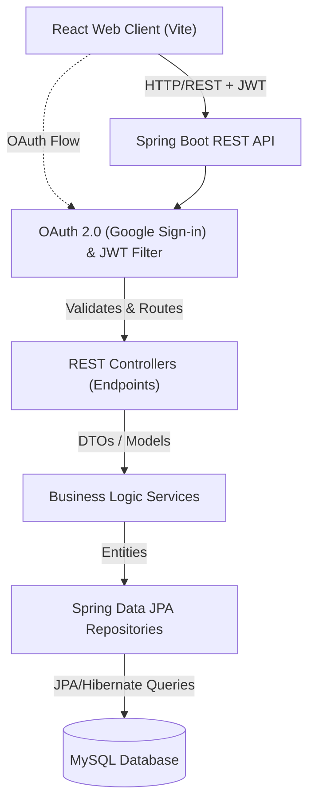
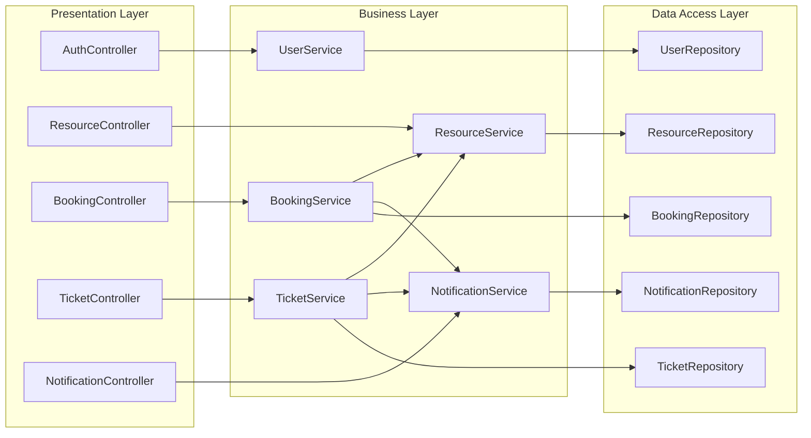
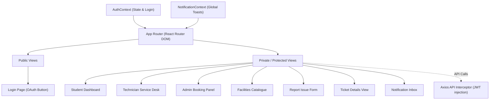

# Smart Campus Operations Hub - Architecture Diagrams
You can copy and paste these Mermaid graph code blocks into any Markdown viewer that supports Mermaid (like GitHub, Notion, or a Mermaid Live Editor) to generate the images for your final PDF report.

## 1. Overall System Architecture
This diagram illustrates the high-level layered architecture of the application, showing how the React frontend interacts with the Spring Boot backend and MySQL database.

## 2. REST API Architecture (Backend)
This demonstrates the layered architecture of the Spring Boot application specifically, separating concerns between routing, business logic, and data access.

## 3. Frontend Architecture (React)
This diagram maps out how the React application is structured, including contexts, routing, and key pages.

