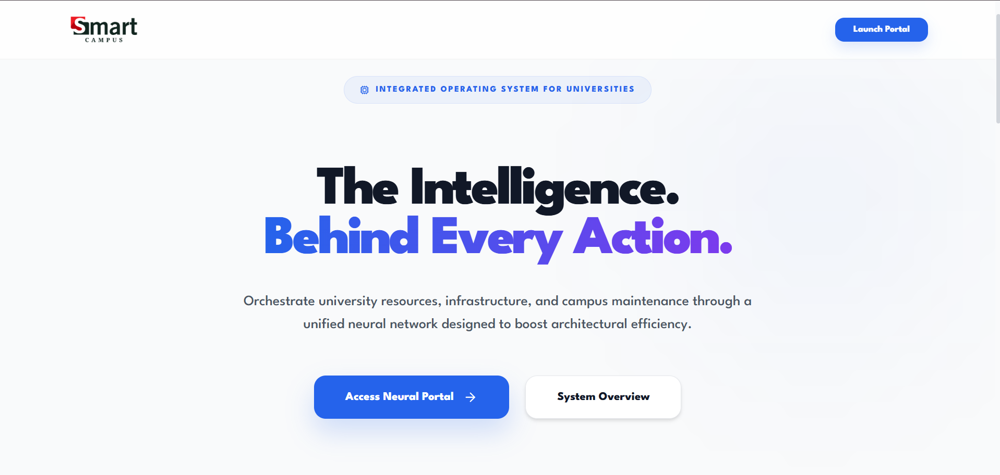
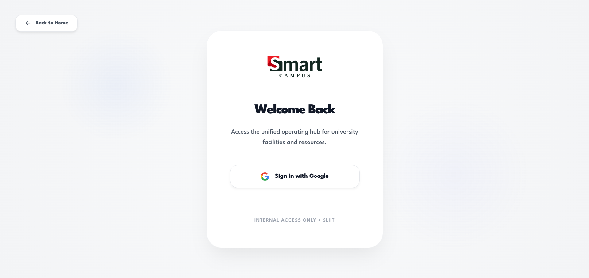
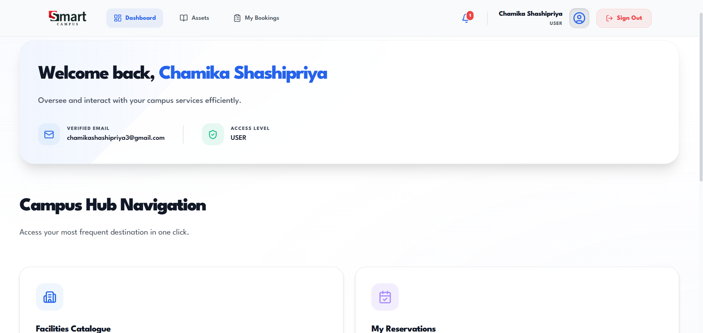
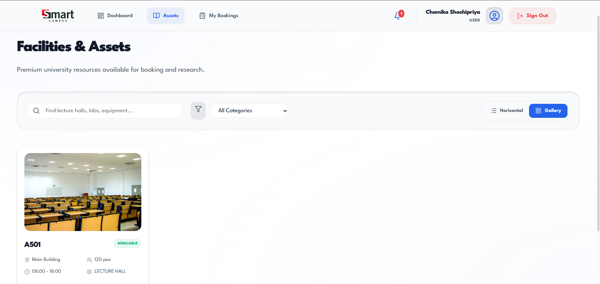
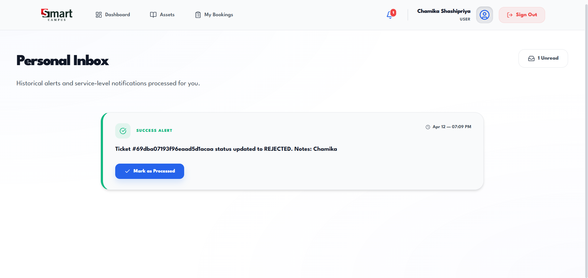
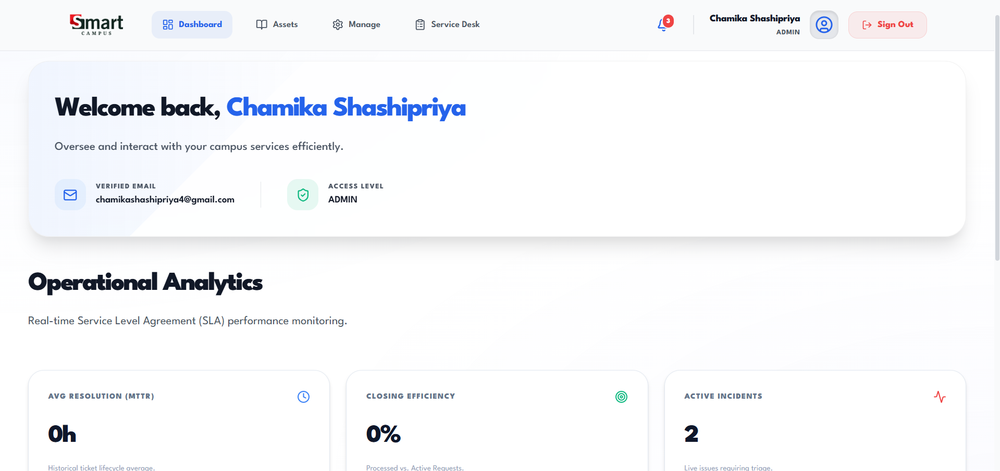
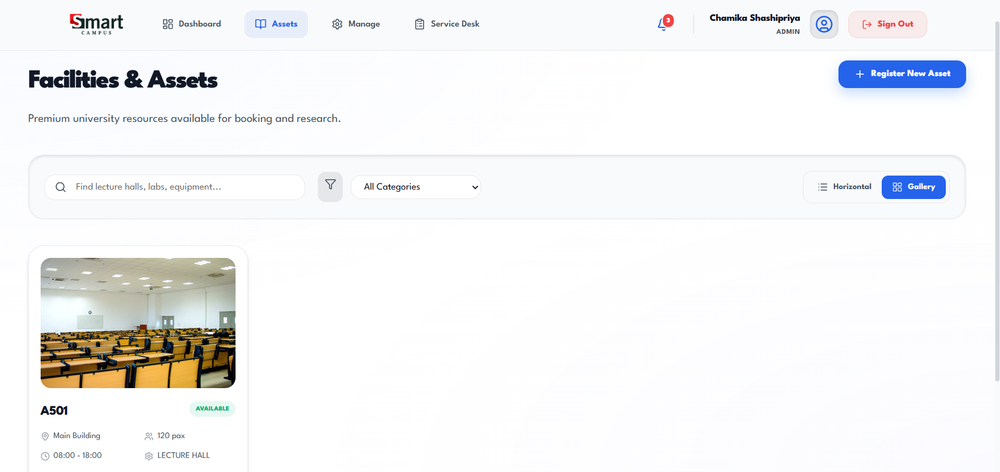
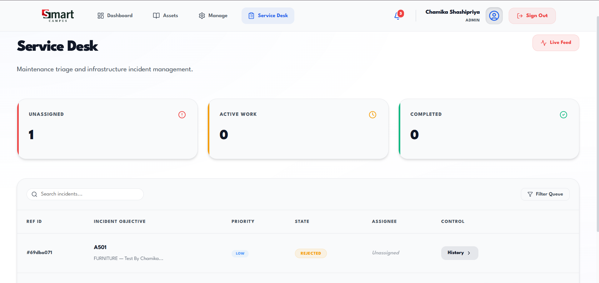

# Smart Campus Operations Hub 🏫✨

A premium, state-of-the-art university facility management system built for the **IT3030 PAF Assignment (2026)**. This platform features a high-fidelity **Pristine Tech (Light)** theme, real-time notifications, and advanced resource tracking.

## 🌟 Key Highlights
*   **Pristine Tech Aesthetics**: Custom-built with a clean light palette, soft multi-layered shadows, and minimalist geometric typography.
*   **Dynamic Catalogue**: Switch between **Premium Horizontal List** and **Modern Grid** views with real-time fuzzy search.
*   **Advanced Ticket Lifecycle**: Complete incident management from reporting with attachments to resolution by technicians.
*   **Role-Based Access**: specialized dashboards for Students, Admins, and Engineering Technicians.

---

## 📸 Visual Tour

### Enterprise Navigation
Clean, sticky navigation optimized for high-density campus operations.

| User-Dashboard | User-Catalogue | Notifications |
| :--- | :--- | :--- |
|  |  |  |

### Administrative Control
Powerful tools for managing campus resources and maintenance triage.

| Admin-Dashboard | Asset-Control | Service-Desk |
| :--- | :--- | :--- |
|  |  |  |

---

## 🚀 Optional Innovations (Bonus Marks)

### I. QR Secured Facility Check-in
*   **Encrypted Passwords**: Unified QR tokens generated for every approved reservation.
*   **Security Protocol**: Staff can scan/simulate check-ins to verify physical occupancy in real-time.
*   **Status Lifecycle**: Bookings transition from `APPROVED` to `CHECKED_IN` upon successful scan.

### II. Advanced SLA Analytics Engine
*   **Predictive Maintenance**: Real-time tracking of **Mean Time To Resolution (MTTR)**.
*   **Efficiency Metrics**: Automatic calculation of "Closing Rate" and "Triage Volume" on the Admin Dashboard.
*   **Temporal Logging**: Backend-level timestamping for `Ticket` finalization events.

---

## 🛠️ Modules (PAF Requirements)

### Module A: Facilities & Assets Catalogue
*   **Metadata Integration**: Tracks capacity, location, and maintenance status (`ACTIVE`, `OUT_OF_SERVICE`).
*   **Smart Filtering**: Instant search capabilities to locate specific campus hardware or rooms.

### Module B: Booking Management
*   **Conflict Prevention**: Backend logic automatically detects and prevents overlapping booking requests.
*   **Reasoned Workflow**: Admins can approve or reject requests with custom feedback.

### Module C: Maintenance & Incident Ticketing
*   **Visual Evidence**: Support for up to 3 image attachments per incident.
*   **Comment Chain**: Full correspondence history with **Ownership-based Edit/Delete** capabilities.

### Module D & E: Core Infrastructure
*   **Notification Engine**: Real-time alerts for booking updates and ticket changes.
*   **Secure Auth**: Integration with **Google OAuth 2.0** for seamless campus single sign-on.

---

## 💻 Tech Stack
*   **Frontend**: React 18, Vite, Vanilla CSS (Premium Design System).
*   **Backend**: Spring Boot 3.4, Spring Security, MongoDB.
*   **Architecture**: Layered Service Architecture with RESTful best practices. [Review Detailed Diagrams here](docs/ARCHITECTURE.md).

---

## 🚀 Getting Started

### Prerequisites
*   Java 21+
*   Node.js 18+
*   MongoDB Instance (Local or Atlas)

### Installation
1.  **Clone the Repository**
2.  **Backend Setup**: 
    *   Set up your `application.yml` with MongoDB URI and Google Client ID/Secret.
    *   Run `BackendApplication.java`.
3.  **Frontend Setup**:
    *   `cd frontend`
    *   `npm install`
    *   `npm run dev`
4.  **Access**: Navigate to `http://localhost:5173`.

---

**Student Name**: Kumarathunga R C S  
**IT Number**: IT23257054  