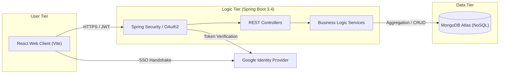
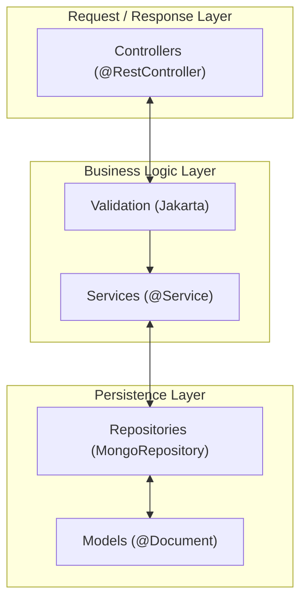
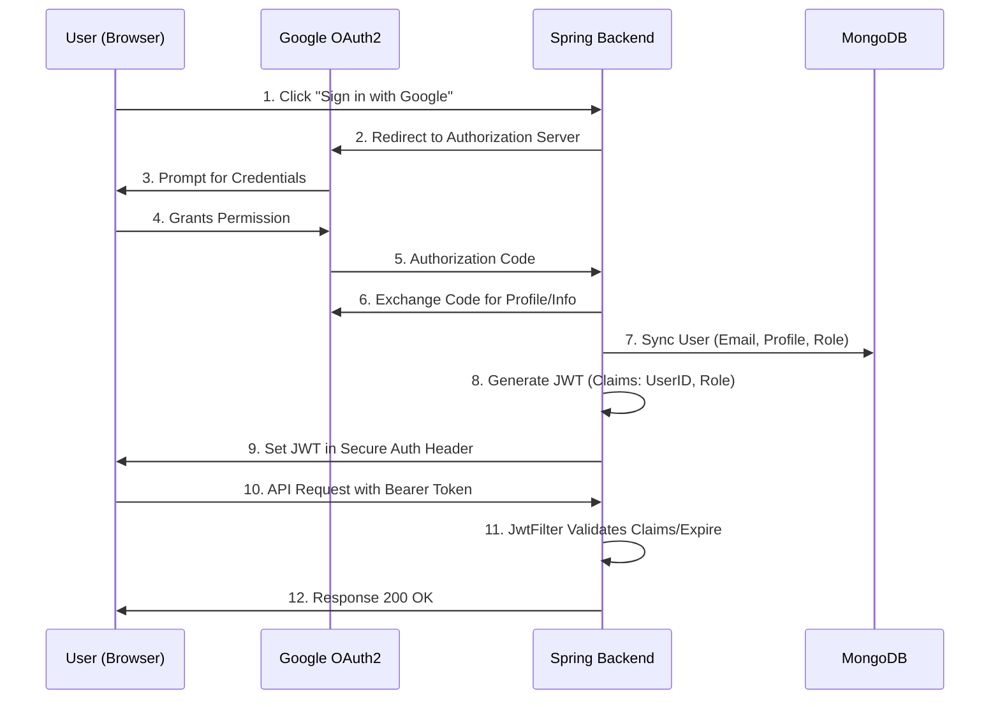
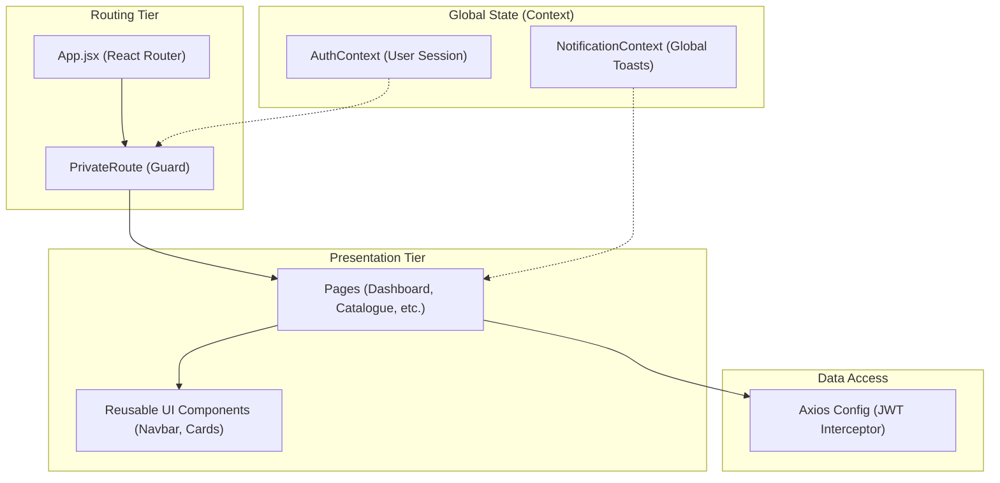

# Smart Campus Operations Hub - Architecture Documentation 🏛️

This document outlines the technical architecture of the SmartCampus platform, fulfilling the core documentation requirements for the **IT3030 PAF Assignment**.

---

## 1. System Architecture (High-Level)
The system follows a classic **Client-Server** architecture optimized for cloud scalability.

---

## 2. Backend Layered Architecture
The Spring Boot backend is structured using a strict **Layered Pattern** to ensure separation of concerns and maintainability.

---

## 3. Security Architecture (Identity Flow)
This diagram illustrates the stateless **OAuth2-to-JWT** bridge, which handles authentication and role delegation.

---

## 4. Frontend Component Architecture
The React application is built on a **Modular Hook-based** architecture, leveraging Context API for global state management.

---

## 4. Key Performance & Security Decisions
*   **JWT Authentication**: Stateless authentication using secure local storage tokens for API authorization.
*   **OAuth2 Profile Synchronization**: A custom implementation in `OAuth2LoginSuccessHandler` that extracts `picture` attributes from Google and persists them to the MongoDB user store, ensuring a personalized UI.
*   **Notification Preferences (Innovation)**: Implemented a highly granular, category-based notification system. Users can toggle visibility for specific alert types (**Info, Success, Warning**) via a premium settings panel, with backend filtering logic ensuring low-latency delivery of only relevant data.
*   **NoSQL Flexibility**: MongoDB was chosen to handle the semi-structured nature of "Incident Reports" and "Resource Metadata".
*   **Pristine Tech Design System**: Custom Vanilla CSS tokens used instead of bloated frameworks to ensure sub-second rendering and a premium, geometric aesthetic.
