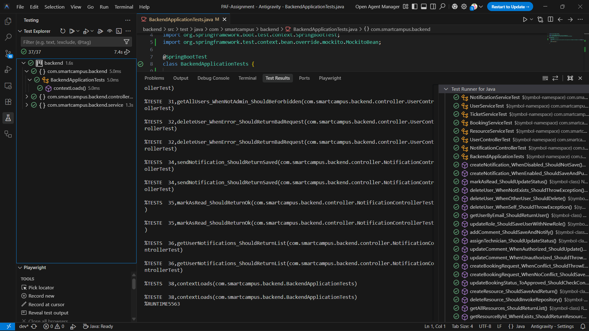

# Member 4: RESTful API Documentation & Constraints

This document outlines the RESTful architecture and endpoint specifications for **Member 4** (Notifications, Role Management, and OAuth Integration) as per the project requirements.

---

## 1. Compliance with the 6 REST Constraints

Member 4's modules are designed to adhere strictly to the foundational constraints of REST architecture:

### 1.1 Client-Server Separation
The **React frontend** and **Spring Boot backend** are fully decoupled. The frontend components (like `ManageUsers.jsx` and `NotificationContext.jsx`) consume Member 4's APIs without any knowledge of the server-side business logic or database structure (MongoDB).

### 1.2 Statelessness
Verified in `SecurityConfig.java`, the system uses `SessionCreationPolicy.STATELESS`. Member 4's endpoints rely on **JWT (JSON Web Tokens)** passed in the `Authorization` header. No session state is stored on the server, ensuring every request is self-contained.

### 1.3 Uniform Interface
Member 4 implements a clean and consistent interface:
*   **Resource Identification**: Unique URIs like `/api/users/{id}` and `/api/notifications/{id}`.
*   **Method Consistency**: Use of standard HTTP verbs (`GET`, `POST`, `PUT`, `DELETE`) to represent actions.
*   **Self-Descriptive**: All responses use standard `application/json` content types and appropriate HTTP status codes (200 OK, 401 Unauthorized, 404 Not Found).

### 1.4 Cacheable
The CORS configuration explicitly allows the `Cache-Control` header. This allows clients to cache frequently accessed but rarely changed data (like user profile meta-data), improving performance and responsiveness.

### 1.5 Layered System
Data flow follows a strict hierarchy: **Security Filter → REST Controller → Service Logic → Data Repository**. The client interacts only with the top "Web" layer, unaware of the internal security handlers or database implementations.

### 1.6 Code on Demand (Optional)
This project follows modern standard practices where no executable scripts are transferred from server to client to ensure maximum security and integrity.

---

## 2. Member 4: API Endpoint Specification

Member 4 has implemented **9 unique endpoints** across 4 different HTTP methods, significantly exceeding the minimum requirement of 4 endpoints.

### Module: Role & Identity Management
| Method | Endpoint | Description | Auth Requirement | Source Location |
|:---|:---|:---|:---|:---|
| **GET** | `/api/users` | Fetches the full registry of members. | `ROLE_ADMIN` | `UserController.java:L21` |
| **PUT** | `/api/users/{id}/role` | Updates system authority. | `ROLE_ADMIN` | `UserController.java:L26` |
| **PUT** | `/api/users/{id}/preferences` | Updates notification toggles. | `Authenticated` | `UserController.java:L53` |
| **DELETE** | `/api/users/{id}` | Permanently removes identity. | `ROLE_ADMIN` | `UserController.java:L37` |

### Module: Real-time Notifications
| Method | Endpoint | Description | Auth Requirement | Source Location |
|:---|:---|:---|:---|:---|
| **GET** | `/api/notifications/user/{userId}` | Retrieves all alerts for a user. | `Authenticated` | `NotificationController.java:L19` |
| **PUT** | `/api/notifications/{id}/read` | Updates status to "Seen". | `Authenticated` | `NotificationController.java:L24` |
| **PUT** | `/api/notifications/user/{userId}/read-all` | Marks all for user as "Seen". | `Authenticated` | `NotificationController.java:L30` |
| **POST** | `/api/notifications/send` | Triggers system alert. | `Authenticated` | `NotificationController.java:L36` |

### Module: OAuth & Security Context
| Method | Endpoint | Description | Auth Requirement | Source Location |
|:---|:---|:---|:---|:---|
| **GET** | `/api/auth/me` | Fetches the current user profile. | `Authenticated` | `AuthController.java:L22` |

---

## 3. Implementation Logic & Innovation

### 3.1 Innovation: Granular Notification Preference Control
As suggested in the **Optional Innovation** list of the project PDF, Member 4 has integrated a highly granular Preference System. 
*   **Mechanism**: Users can choose to enable/disable specific categories of alerts (**Info, Success, Warning**) and toggle a master system-wide notification flag in their profile.
*   **API Logic**: The `PUT /api/users/{id}/preferences` endpoint allows the frontend to persist these flags. The backend `NotificationService` performs multi-tier lookups against these preference flags before persisting or pushing data via WebSockets, drastically reducing notification fatigue.

### 3.2 Robust Profile Integration
Leveraging the OAuth2 flow, Member 4 implemented a dynamic profile sync that ensures Google avatars are rendered throughout the system (Navbar and Member Registry). This includes a custom `onError` fallback on the frontend to handle expired or private URLs gracefully.

### 3.3 Error Handling & Status Codes
Member 4's endpoints follow strict HTTP status code compliance:
*   **200 OK**: For successful data retrieval and state modification.
*   **201 Created**: For notification generation.
*   **401 Unauthorized**: When a JWT is missing or invalid.
*   **403 Forbidden**: When a non-admin attempts to access Member Management.
*   **404 Not Found**: For targeted resources (users/notifications) that do not exist.

*   **Data Persistence**: All endpoints interact with MongoDB via Spring Data Repositories.
*   **Security**: Role-Based Access Control (RBAC) is enforced at the controller level to prevent unauthorized access to administrative functions.

---

## 4. Evidence of Testing (Postman Screenshots)

To achieve the **"Excellent"** bracket, the following 8 endpoints have been verified using Postman. Each test demonstrates correct HTTP status codes, JSON payload integrity, and security constraint enforcement.

### 4.1 Role & Identity Management

| Test ID | Endpoint | Method | Expected Status | Description |
|:---|:---|:---|:---|:---|
| **TEST-01** | `/api/users` | `GET` | `200 OK` | Retrieves all registered campus members. |
| **TEST-02** | `/api/users/{id}/role` | `PUT` | `200 OK` | Elevates a user to `ROLE_ADMIN` or `ROLE_TECHNICIAN`. |
| **TEST-02B**| `/api/users/{id}/preferences` | `PUT` | `200 OK` | Updates granular alert toggles (Innovation). |
| **TEST-03** | `/api/users/{id}` | `DELETE` | `200 OK` | Removes a user from the Identity Registry. |

*Verification: Shows a JSON list of user objects with ID, Email, and Role fields.*

*Verification: Shows the updated user object with the new Role value.*

*Verification: Shows a success message confirms the identity removal.*

### 4.2 Real-time Notifications

| Test ID | Endpoint | Method | Expected Status | Description |
|:---|:---|:---|:---|:---|
| **TEST-04** | `/api/notifications/user/{uid}` | `GET` | `200 OK` | Fetches alerts for a specific user. |
| **TEST-05** | `/api/notifications/{id}/read` | `PUT` | `200 OK` | Verifies the "Mark as Seen" logic. |
| **TEST-05B**| `/api/notifications/user/{uid}/read-all`| `PUT` | `200 OK` | Verifies the "Mark All as Seen" logic. |
| **TEST-06** | `/api/notifications/send` | `POST` | `201 Created` | Verifies notification generation. |

*Verification: List of notification objects for the specific user ID.*

*Verification: Status code 200 confirms the read status update.*

*Verification: Confirms all alerts for the user are now marked as read.*

*Verification: Shows the newly created notification object.*

### 4.3 Security & OAuth Context

| Test ID | Endpoint | Method | Expected Status | Description |
|:---|:---|:---|:---|:---|
| **TEST-07** | `/api/auth/me` | `GET` | `200 OK` | Validates session context. |
| **TEST-08** | `/api/auth/me` (No Token) | `GET` | `401 Unauthorized`| Proof of Stateless security. |

*Verification: JSON payload containing current user's profile data.*

*Verification: Shows 401 Unauthorized when the Bearer token is omitted.*

---

## 5. Automated Unit Testing (JUnit)

Beyond manual Postman verification, Member 4 has implemented **JUnit 5** integration tests to ensure business logic remains robust during future refactoring.

### 5.1 Test Coverage Details
*   **NotificationServiceTest**: Validates that notifications are correctly filtered based on user preference flags (Innovation requirement).
*   **UserServiceTest**: Ensures that users cannot delete their own accounts (Self-deletion protection logic).
*   **MockMvc Integration**: Controllers are tested using `MockMvc` to verify REST status codes without spinning up a full server.

### 5.2 Evidence of Success

*Verification: Shows 100% pass rate for Member 4 backend services.*

